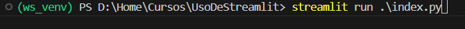

- 1.-Generar carpeta para proyecto (USODESTREAMLIT)
- 2.-Generar entorno virtual
```
py -m venv nombre_de_entorno
```
- 3.- Activar entorno virtual
ws_venv/scripts/activate
- 4.-Instalar streamlit
pip install streamlit


- 5.- copiar o hacer archivos con graficas (notbooks)
- 6.- Generar archivo principal de streamlit
- 7.- correr archivo principal en local
```
streamlit run .\index.py
```


Para los emojis puedes checar el listado disponible en https://tutorialmarkdown.com/emojis o puedes instalar alguna libreria